##
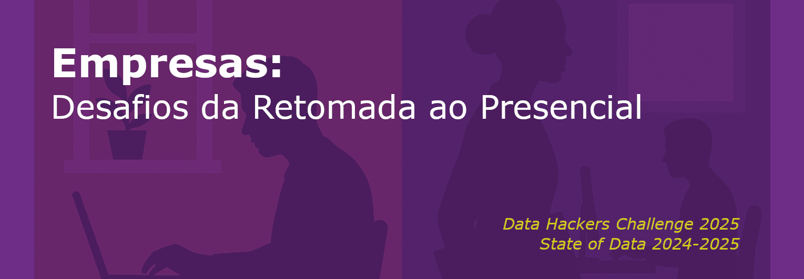

## Sobre o Projeto

Este projeto foi desenvolvido no formato de [notebook](https://github.com/ClaytonSdS/DataHackers2025/blob/main/empresas-desafios-da-retomada-ao-presencial.ipynb), como parte da participação no **Challenge State of Data 2024-2025**, promovido pela **Data Hackers**.

Este projeto também está disponível na plataforma Kaggle: [Empresas - Desafios da Retomada ao Presencial](https://www.kaggle.com/code/claytonsds/empresas-desafios-da-retomada-ao-presencial).

O desafio consistiu na elaboração de um estudo de caso a partir de um dataset contendo **8 questionários** com informações sobre profissionais do setor de tecnologia, coletadas entre 2024 e 2025.

Os questionários foram organizados em 8 seções:

1. **Dados Demográficos**  
2. **Informações sobre a Carreira**  
3. **Desafios enfrentados por gestores de times de dados**  
4. **Conhecimentos gerais na área de dados**  
5. **Objetivos profissionais na área de dados**  
6. **Conhecimentos em Engenharia de Dados (DE)**  
7. **Conhecimentos em Análise de Dados (DA)**  
8. **Conhecimentos em Ciência de Dados (DS)**  

O dataset contém **5.215 entradas**. Durante o desafio, foi realizado o tratamento, processamento e visualização dos dados, resultando em um relatório com **insights extraídos e um plano de ação proposto pelo autor**.

Nosso projeto abordou o desafio do **retorno ao trabalho presencial**, sob a perspectiva das empresas. Propusemos uma série de [análises estatísticas](#desenvolvimento-e-análise-estatística) com o objetivo de **apoiar os tomadores de decisão na contratação de novos profissionais**.

Além disso, desenvolvemos uma [ferramenta de Machine Learning](#modelo-de-classificação-ia) capaz de classificar, com base nos dados de um ou mais candidatos, a **aceitação ou não do retorno ao trabalho presencial**.

<a id="top"></a>
##  Sumário
* [Cálculo da Probabilidade Condicional](#cálculo-da-probabilidade-condicional)
* [Introdução](#introdução)
* [Desenvolvimento e Análise Estatística](#desenvolvimento-e-análise-estatística)
  * [Status e Modelo de Trabalho](#status-e-modelo-de-trabalho)
  * [Setor de Atuação](#setor-de-atuação)
  * [Análise de Correlação](#análise-de-correlação)
  * [Análise Geográfica](#análise-geográfica)
  * [Análise de Preferências](#análise-de-preferências)
  * [Análise de Perfil](#análise-de-perfil)
* [Modelo de Classificação (IA)](#modelo-de-classificação-ia)
  * [Arquitetura do Modelo](#arquitetura-do-modelo)
  * [Hiperparâmetros de Treinamento](#hiperparâmetros-de-treinamento)
  * [Validação dos Resultados](#validação-dos-resultados)
  * [Baixar o modelo](#baixar-o-modelo)
  * [Tutorial de Utilização do Modelo](#tutorial-de-utilização-do-modelo)
* [Conclusão](#conclusão)
* [Referências](#referências)


## Cálculo da Probabilidade Condicional
Para obter uma métrica de avaliação da probabilidade de rejeição por parte de um profissional da área de tecnologia, iremos considerar tanto variáveis qualitativas (como região de residência, sexo, entre outras) quanto quantitativas (como idade).

Por exemplo, deseja-se calcular a probabilidade de um indivíduo rejeitar a proposta de retorno ao modelo presencial, dado que possui uma idade igual a I=x (com base nos dados do dataset).

Nesse caso, essa probabilidade dessa pessoa rejeitar (P(R)) o retorno ao trabalho presencial, dado que ela tem idade I=x, é expressa como:

$$
P(R \mid I = x) = \frac{P(R \cap I = x)}{P(I = x)} = \frac{\text{número de pessoas com idade } x \text{ que rejeitam o retorno}}{\text{número total de pessoas com idade } x}
$$

```python
def prob_condicional(x,
                     coluna_df: str,
                     df_total: pd.DataFrame=q1,
                     df_respostas: pd.Series=p_request_summary_grouped,
                     resposta_negativa: str = 'NÃO') -> float:
    """
    Calcula a probabilidade condicional P(R = resposta_negativa | coluna_df = x)
    
    Parâmetros:
    - x: valor da variável condicional (ex: idade, sexo, região...)
    - coluna_df: nome da coluna da variável (ex: 'idade', 'sexo')
    - df_total: DataFrame com todos os dados (contendo a coluna 'coluna_df')
    - df_respostas: Série com as respostas (index compatível com df_total)
    - resposta_negativa: valor da resposta considerada como "rejeição" (padrão: 'NÃO')
    
    Retorna:
    - Probabilidade condicional P(rejeição | coluna = x)
    """

    # Índices dos registros onde a coluna tem valor x
    indices_com_x = df_total[df_total[coluna_df] == x].index

    # P(X = x)
    P_x = len(indices_com_x) / len(df_total)

    # Índices das pessoas que deram a resposta negativa
    indices_rejeicao = df_respostas[df_respostas == resposta_negativa].index

    # Interseção dos dois grupos
    intersecao = set(indices_com_x).intersection(set(indices_rejeicao))

    # P(R ∩ X = x)
    P_intersec = len(intersecao) / len(df_total)

    # P(R | X = x)
    P_cond = P_intersec / P_x if P_x > 0 else 0

    return P_cond
```

[↑ Top](#top)

## Introdução
O mundo atual é marcado por dinâmicas cada vez mais complexas e aceleradas. Durante décadas, o trabalho presencial foi amplamente adotado como padrão nas relações laborais, sendo considerado pelas empresas a fórmula ideal de eficiência e controle produtivo. No entanto, a pandemia de Covid-19 impôs uma ruptura abrupta a esse modelo. Com os lockdowns e as restrições sanitárias globais, organizações de diversos setores foram forçadas a adotar soluções alternativas, como o trabalho remoto e modelos híbridos, flexibilizando estruturas que antes pareciam inquestionáveis.

À medida que o cenário sanitário começou a se estabilizar com o avanço da vacinação, emergiu uma nova fase de decisões organizacionais: a de como (e se) retornar ao modelo anterior. Nesse contexto, muitas empresas — especialmente as de perfil mais tradicional — optaram por retomar rapidamente o trabalho 100% presencial. Esse movimento foi motivado, em parte, por um ceticismo enraizado entre líderes empresariais: “81% dos empregadores estão céticos quanto à produtividade no trabalho remoto, enquanto 77% dos funcionários acreditam que a volta ao escritório é mais uma questão de aparência do que de resultados”. Ainda assim, paradoxalmente, muitas dessas mesmas empresas relataram um aumento de até 19% na produtividade e no engajamento dos colaboradores após o retorno presencial [[4](#ref-4)].

Nesse contexto, este relatório busca explorar como a exigência pela retomada do modelo presencial tem impactado a percepção dos trabalhadores, bem como os principais desafios enfrentados pelas organizações nesse processo de adaptação pós-pandemia. Além disso, o relatório tem como foco avaliar as tendências e preferências da nova geração que comporá o mercado de trabalho nos próximos anos, desenvolvendo um modelo de classificação capaz de prever se um usuário com determinado perfil tende a preferir o formato presencial (*seção Modelo de Classificação (IA)*).

Essa ferramenta poderá servir como uma solução para a avaliação de candidatos, sendo utilizada em processos seletivos por empresas que buscam identificar profissionais dispostos a atuar presencialmente, considerando seu perfil e modo de trabalho atual — seja remoto, híbrido ou presencial.

Para tanto, o relatório se baseia na análise dos dados do dataset “State of Data Brazil 2024-2025”, que visa mapear o mercado de trabalho da área de dados no Brasil, refletindo o perfil dos profissionais — como analistas, cientistas e engenheiros de dados —, suas preferências e valores no âmbito corporativo.

[↑ Top](#top)

## Desenvolvimento e Análise Estatística
### Status e Modelo de Trabalho
<a id="ref-figura1"></a>
Com base na [`Figura 1`](#ref-figura1), observa-se que profissionais já inseridos em modalidades de trabalho flexíveis, como o modelo híbrido ou totalmente remoto, demonstram uma inclinação significativa em permanecer nesses formatos.

No caso específico dos que atuam em regime híbrido, destaca-se que mais de 70% não estão dispostos a retornar ao modelo 100% presencial — evidenciado, inclusive, pelos 10.7% que manifestam intenção de buscar novas oportunidades exclusivamente remotas.

De maneira ainda mais acentuada, profissionais em regime remoto apresentam baixíssima predisposição ao retorno presencial, com apenas 8.7% sinalizando essa possibilidade.

Diante desses dados, é possível inferir que apenas os profissionais já atuantes em regime presencial — e que, portanto, já possuem familiaridade e possível preferência por esse formato — demonstram uma intenção clara de permanecer nesse modelo de trabalho.

<a href="figures/fig1.png">
  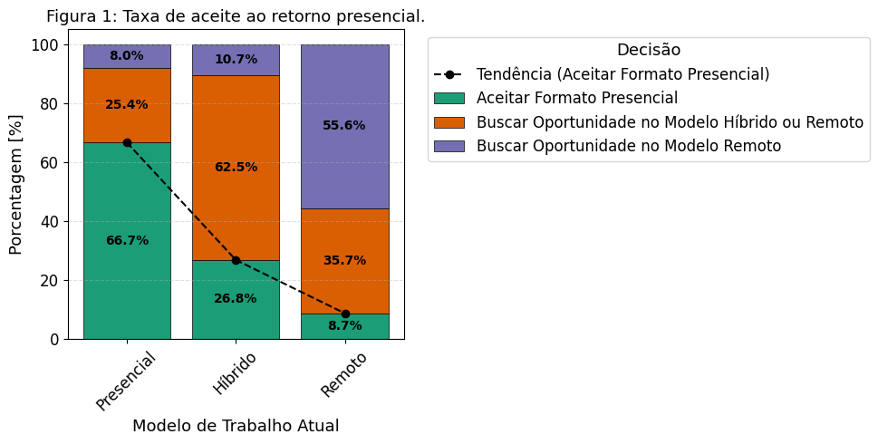
</a>

<a id="ref-figura2"></a>
Além disso, conforme evidenciado na [`Figura 2`](#ref-figura2), o fato de a pessoa estar empregada ou não, impacta diretamente nas chances de recusa ao retorno presencial. 

Isso porque, como mostra a figura, profissionais atualmente empregados demonstram maior resistência ao retorno obrigatório, o que sugere que a estabilidade no emprego lhes confere maior poder de escolha quanto ao formato de trabalho desejado.

<a name="ref-figura2"></a>
<a href="figures/fig2.png">
  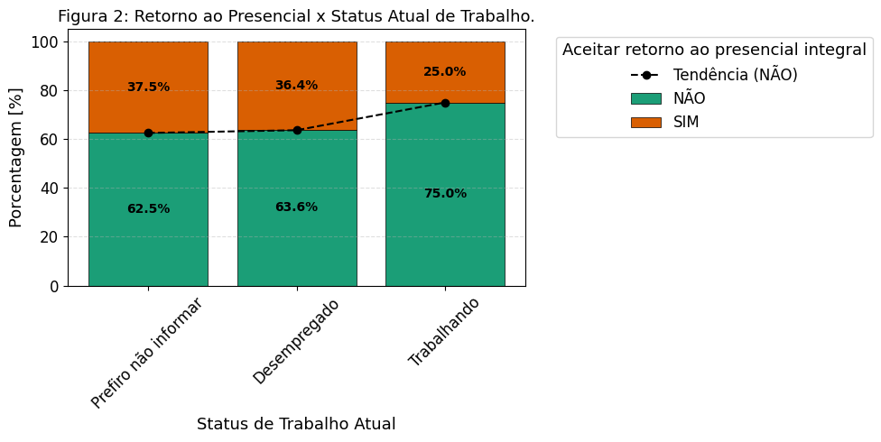
</a>

Nota-se que, independentemente de a pessoa estar trabalhando ou desempregada, em ambos os casos a probabilidade de aceitar uma mudança para o trabalho presencial integral é claramente baixa em comparação com a rejeição dessa adoção. 

Mesmo entre as pessoas que optaram por não informar seu status profissional, ainda é possível observar esse padrão comportamental consistente.

[↑ Top](#top)

### Setor de Atuação
<a id="ref-figura3"></a>
Para investigar se o setor de atuação exerce influência sobre a aceitação do retorno ao trabalho presencial integral, analisou-se a probabilidade de rejeição condicional ao setor de atuação (P[Rejeição | Setor]) para cada segmento presente no conjunto de dados.

Os resultados, conforme indicado na [`Figura 3`](#ref-figura3), demonstram que o setor de atuação influencia significativamente essa probabilidade. Setores tradicionalmente associados à tecnologia, como Tecnologia/Fábrica de Software, Internet/Ecommerce e Telecomunicação, apresentam as maiores taxas de rejeição. Em contraste, setores como o Setor Público, Agronegócio e Construção Civil demonstram menor resistência ao retorno presencial, indicando maior disposição dos profissionais desses segmentos em adotar esse modelo.

<a name="ref-figura3"></a>
<a href="figures/fig3.png">
  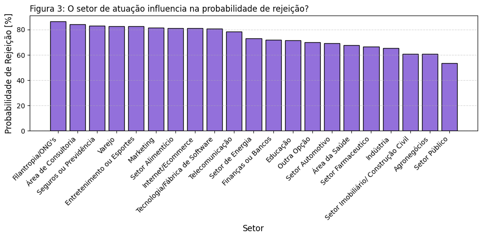
</a>

Esse fator pode ser validado, haja vista que 57% dos servidores públicos federais preferiram voltar ao trabalho presencial após o lockdown obrigatório [[4](#ref-4)]. Além disso, setores como o agronegócio e a construção civil desempenharam um papel de grande relevância durante o período da pandemia em 2020, tendo, em alguns casos, obtido saldo acumulado positivo ao longo do ano [[3](#ref-3)],[[5](#ref-5)].

Por outro lado, setores voltados ao mundo digital apresentaram uma tendência distinta [[7](#ref-7)]. Segundo a pesquisa sobre modelos de trabalho realizada pela Robert Half no Brasil, 43% dos profissionais considerariam deixar seus empregos caso perdessem a possibilidade de atuar remotamente ou em regime híbrido [[8](#ref-8)], esse fato explica a tendência que podemos visualizar na [`Figura 1`](#ref-figura1).

[↑ Top](#top)

### Análise de Correlação 

Para a análise de correlação, estudou-se a relação entre as variáveis idade e faixa salarial e como elas afetam a probabilidade de rejeição de um profissional. Essa análise foi realizada com base no coeficiente de determinação (R²), utilizado para avaliar o quão bem o modelo de regressão explica a variável “probabilidade de rejeição”. Além disso, foram considerados modelos de regressão polinomial de grau 1 (P₁) e grau 2 (P₂) durante o estudo.

O primeiro estudo analisou a relação entre as variáveis *Idade* e *Probabilidade de Rejeição*. Conforme ilustrado na [`Figura 4`](#ref-figura4), a idade não se mostra um fator determinante para explicar essa probabilidade. Isso é evidenciado pelos coeficientes de determinação (R²) obtidos nos modelos polinomiais de 1º e 2º grau, que foram de 0,13 e 0,29, respectivamente. Tais valores indicam que a idade, isoladamente, apresenta baixo poder explicativo sobre a rejeição de um profissional.

<a id="ref-figura4"></a>
O fato de a idade não ser determinante, ou seja, de haver consenso entre diferentes faixas etárias sobre a temática, é corroborado por uma pesquisa publicada na *Harvard Business Review* em 2023 [[2](#ref-2)]. Onde a pesquisa revela que aproximadamente 21% dos trabalhadores estão dispostos a aceitar uma redução salarial superior a 10% para continuar trabalhando remotamente. Esses dados indicam que a preferência por modelos de trabalho remoto ou híbrido transcende faixas etárias, sugerindo que a idade não é um fator determinante na escolha do modelo de trabalho.

<a name="ref-figura4"></a>
<a href="figures/fig4.png">
  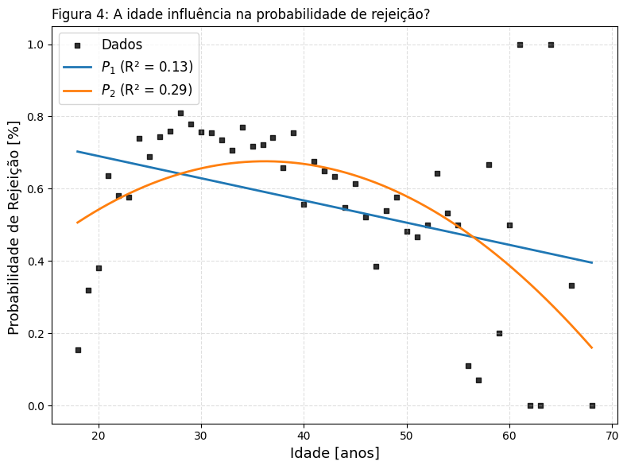
</a>

Por conseguinte, para avaliar e responder à pergunta de que a faixa salarial talvez influencie na rejeição de um profissional, estudaram-se diversas faixas salariais, desde pessoas que recebem menos de `R$` 1.000 por mês até aquelas que recebem acima de `R$` 40.000.

Conforme pode ser observado na [`Figura 5`](#ref-figura5), a faixa salarial possui alto poder explicativo sobre a variável preditora da probabilidade de rejeição. Isso é evidenciado pelos coeficientes de determinação nos modelos polinomiais P₁ e P₂, que apresentam valores de 0.45 e 0.77, respectivamente.

<a id="ref-figura5"></a>
Portanto, considerando o modelo de regressão do polinômio P₂, aproximadamente 77% da variabilidade dos dados pode ser explicada por essa variável (faixa salarial). Esse valor indica uma forte correlação entre as variáveis.

<a name="ref-figura5"></a>
<a href="figures/fig5.png">
  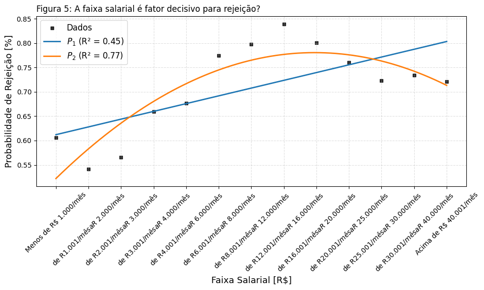
</a>

[↑ Top](#top)

### Análise Geográfica

A próxima linha de análise concentrou seu foco na dimensão geográfica, buscando avaliar se fatores como a região atual de residência do indivíduo influenciam sua decisão. Além disso, analisou-se o padrão de migração entre regiões, com o objetivo de identificar em quais localidades as empresas deveriam concentrar seus esforços para enfrentar possíveis dificuldades na contratação de profissionais dispostos a trabalhar presencialmente.

Dito isso, conforme podemos observar na [`Figura 6`](#ref-figura6) e [`Figura 7`](#ref-figura7), que relaciona a região com a probabilidade de rejeição, as regiões mais ao Norte do país apresentam uma menor tendência à rejeição do trabalho presencial. Esse dado está alinhado com o estudo conduzido pelo IBRE/FGV (2021) [[1](#ref-1)], que revelou que as regiões Norte e Nordeste apresentam as menores taxas de adoção ao home office, com 21.2% e 21.9%, respectivamente.

<a id="ref-figura6"></a>
Além disso, destaca-se que a região Centro-Oeste registrou a menor probabilidade de rejeição sobre o retorno ao modelo presencial, com aproximadamente 56.32%.

<a id="ref-figura7"></a>
<a name="ref-figura6"></a>
<a href="figures/fig6.png">
  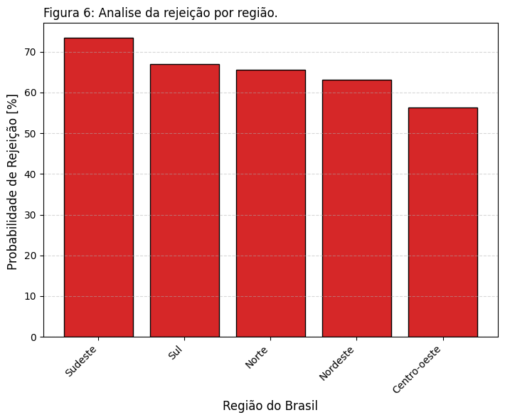
</a>

<a name="ref-figura7"></a>
<a href="figures/fig7.png">
  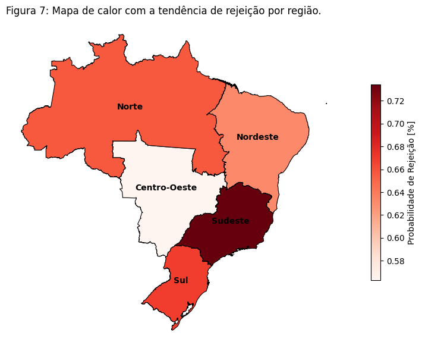
</a>


Com base nessas informações, torna-se possível identificar as regiões com maior suscetibilidade ao trabalho presencial. No entanto, para empregadores localizados em áreas de alta rejeição ao modelo presencial — como o Sudeste e o Sul —, encontrar soluções para esse desafio é essencial. Pensando nisso, foi conduzida uma análise de fluxo migratório entre regiões, apresentada na [`Figura 8`](#ref-figura8). Esse estudo permite responder a uma questão estratégica: em quais regiões buscar mão de obra, considerando não apenas a taxa de rejeição local ao presencial, mas também a predisposição dos profissionais de outras regiões a se mudarem para áreas como o Sul ou Sudeste, onde a empresa está sediada.

Dito isso, conforme podemos visualizar na [`Figura 8`](#ref-figura8), as regiões com as maiores taxas de permanência — e, consequentemente, menor propensão à migração — são, respectivamente, o Sul (90,27%) e o Sudeste (93,79%). Em contrapartida, as regiões com as menores taxas de permanência são o Nordeste, o Centro-Oeste e o Norte, que, como discutido anteriormente na [`Figura 6`](#ref-figura6) e [`Figura 7`](#ref-figura7), também apresentam as menores probabilidades de rejeição ao modelo presencial.

<a id="ref-figura8"></a>
Esses dados indicam que as regiões mais ao Norte do país não apenas demonstram maior disposição para o retorno ao trabalho presencial, mas também maior abertura para migração entre regiões, caso as condições sejam favoráveis. Isso é evidenciado pelo fato de que, na região Norte, apenas 46,67% dos profissionais continuam residindo em seu estado de origem, revelando uma significativa mobilidade geográfica.

<a name="ref-figura8"></a>
<a href="figures/fig8.png">
  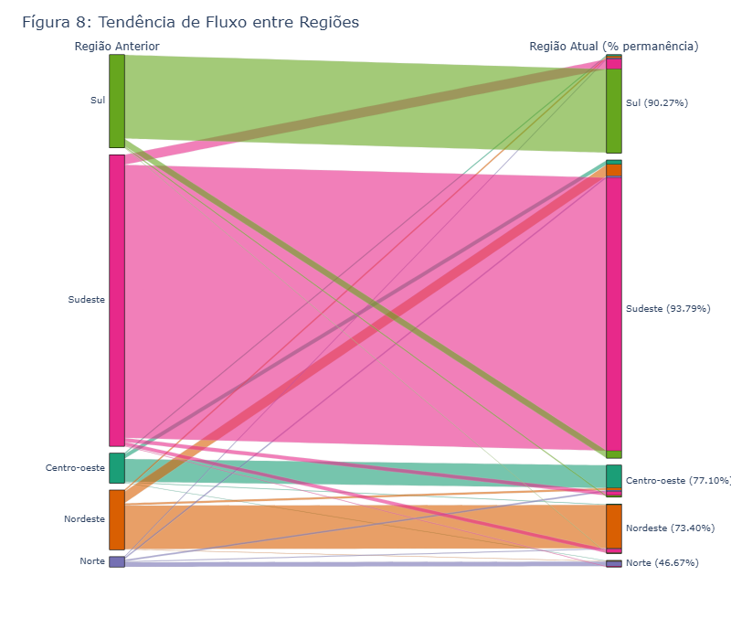
</a>

[↑ Top](#top)

### Análise de Preferências

Uma vez em posse das informações extraídas nas seções anteriores — como a análise da tendência ao retorno presencial com base no status atual de trabalho, a avaliação por setor de atuação, o estudo da correlação entre variáveis relevantes e a análise geográfica relacionada à rejeição do modelo presencial e aos fluxos migratórios —, uma última dimensão se mostra essencial: o entendimento dos critérios dos entrevistados que eles consideram importantes na escolha de uma oportunidade de trabalho. 

<a id="ref-figura9"></a>
Essa análise é de grande relevância, pois ajuda a responder à seguinte questão: uma vez identificada a região ideal para a busca de mão de obra, quais benefícios devem ser oferecidos por uma empresa para maximizar as chances de aceitação da proposta? Com isso, torna-se possível enfrentar o desafio da baixa adesão ao modelo presencial em determinadas regiões ou organizações.

<a name="ref-figura9"></a>
<a href="figures/fig9.png">
  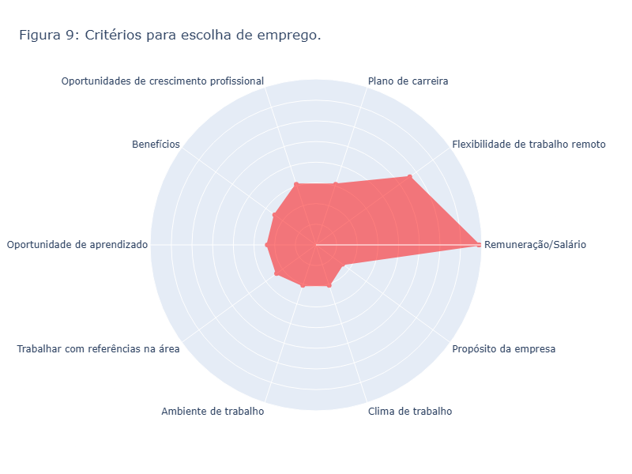
</a>

Dito isso, conforme podemos visualizar na [`Figura 9`](#ref-figura9), os entrevistados demonstraram preferências claras por aspectos relacionados à flexibilização do trabalho e, sobretudo, à remuneração. Essa prioridade é reforçada por dados da Gallup [[6](#ref-6)], que mostram que 64% dos trabalhadores consideram o salário e benefícios como “muito importantes” ao avaliar uma nova proposta de emprego, posicionando-os como os fatores mais decisivos na escolha profissional. 

Além disso, os achados indicam que elementos como o clima organizacional ou o propósito da empresa possuem menor peso frente à perspectiva de uma compensação financeira competitiva.

[↑ Top](#top)

### Análise de Perfil

Para a análise dos entrevistados e a validação de uma possível influência do nível de atuação profissional — i.e., "Júnior", "Pleno" ou "Sênior" — na rejeição ao modelo presencial, é fundamental compreender o perfil etário da amostra.

<a id="ref-figura10"></a>
Conforme podemos observar no histograma da [`Figura 10`](#ref-figura10), a distribuição etária dos participantes revela uma predominância de profissionais jovens, com idades concentradas majoritariamente entre 25 e 35 anos. Isso indica que os dados e os insights extraídos representam, em grande parte, as tendências e preferências da geração atual — e possivelmente da próxima — de candidatos no mercado de trabalho.

<a name="ref-figura10"></a>
<a href="figures/fig10.png">
  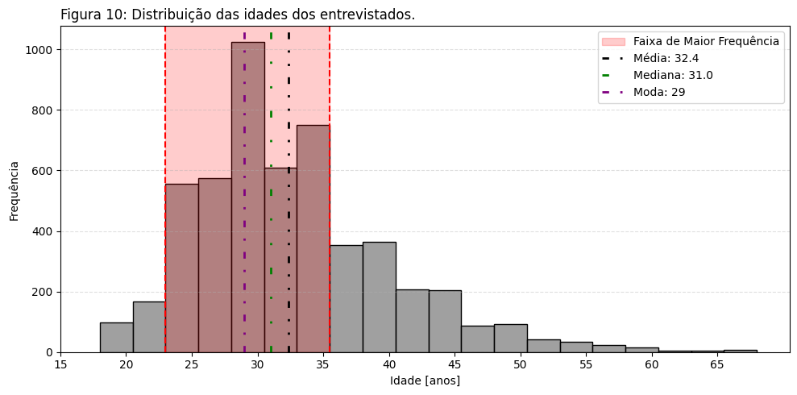
</a>


Conforme podemos visualizar pela [`Figura 10`](#ref-figura10), as pessoas que estão em situação de trabalho ocupando algum nível, estão concentradas na região de 25 a 35 anos, por conseguinte, com base na [`Figura 11`](#ref-figura11) que faz um empilhamento dos niveis em relação a cada idade presente no dataset, podemos visualizar que durante essa faixa etária, os individuos estão em sua maioria em niveis intermediarios como Pleno ou superior Senior.

<a id="ref-figura11"></a>
Da mesma forma, conforme podemos visualizar na [`Figura 12`](#ref-figura12) tais individious, i.e., Plenos e Sêniors, possuem uma alta probabilidade de rejeição ao retorno presencial em relação ao retorno presencial.

<a id="ref-figura12"></a>
<a name="ref-figura11"></a>
<a href="figures/fig11.png">
  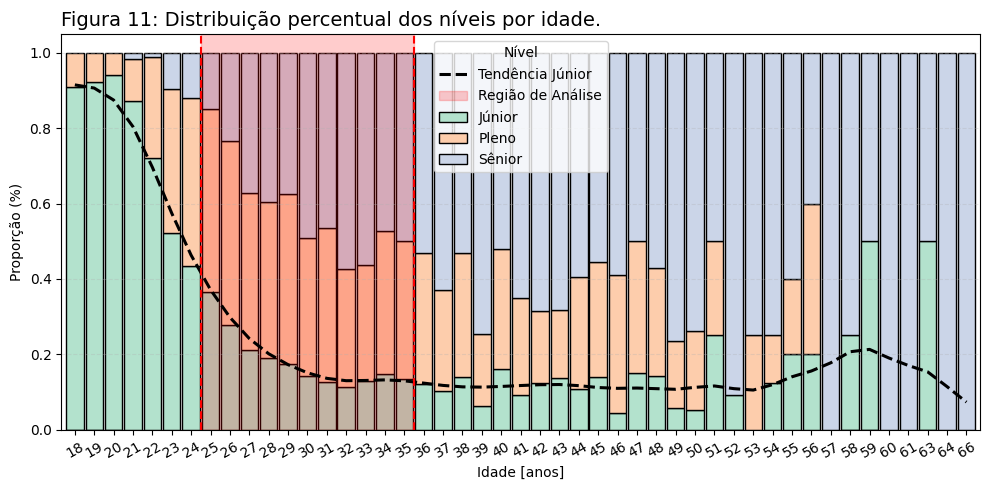
</a>

<a name="ref-figura12"></a>
<a href="figures/fig12.png">
  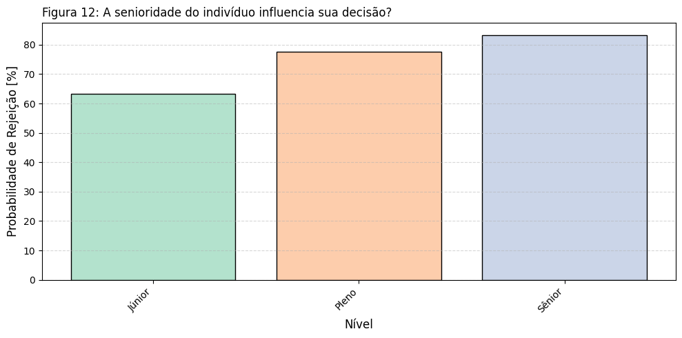
</a>

Em conclusão, uma empresa que esteja buscando pessoas que tenham uma propensão ao modelo presencial deveria priorizar pessoas mais jovens, estando na faixa etária entre 18 e 25 anos, pois, conforme o grafico da [`Figura 11`](#ref-figura11) demonstra, é a região em que possui a maior taxa de individuos no nível "Júnior", que conforme a [`Figura 12`](#ref-figura12), possuem uma menor probabilidade de rejeição ao modelo presencial, em torno de 63.24%.

[↑ Top](#top)

### Modelo de Classificação (IA)
Conforme explicitado durante a análise estatística, o dataset "State of Data Brazil 2024-2025" apresenta variáveis que podem ser utilizadas como features para o treinamento de um modelo de classificação baseado em redes neurais. O objetivo é prever se, dado o histórico de um ou mais candidatos, eles possuem predisposição para aceitar ou não um emprego no formato presencial.

Essa sensibilidade do modelo pode auxiliar tomadores de decisão e recrutadores de RH a ampliar suas buscas por candidatos — não apenas entre aqueles que já atuam em formato presencial (os quais, conforme a análise da [`Figura 1`](#ref-figura1), apresentam maior tendência a aceitar o retorno ao trabalho presencial) — mas também entre aqueles que, embora atualmente estejam em modelos flexíveis, como híbrido ou remoto, possam ter propensão a aceitar um regime presencial.

####  Arquitetura do Modelo

| Camada | Tipo               | Unidades | Função de Ativação | Observações               |
|--------|--------------------|----------|---------------------|---------------------------|
| 1      | Densa (Fully Connected) | 64       | ReLU                |                           |
| 2      | Dropout            | —        | —                   | Taxa de desativação: 0.3  |
| 3      | Densa              | 32       | ReLU                |                           |
| 4      | Densa              | 1        | **Sigmoid**         | Saída binária             |


---

#### Hiperparâmetros de Treinamento

| Parâmetro                  | Valor                     |
|---------------------------|---------------------------|
| Divisão dos dados         | 70% treino / 30% teste    |
| Otimizador                | Adam                      |
| Função de perda           | Binary Crossentropy       |
| Métrica                   | Accuracy                  |
| Taxa de aprendizado       | 0.001                     |
| Tamanho do batch          | 20                         |
| Número de épocas          | 15                        |

#### Validação dos Resultados
<a id="ref-figura13_14"></a>
Os resultados que mostram o histórico de treinamento do modelo ao longo das épocas podem ser visualizados na [`Figura 13`](#ref-figura13_14), que apresenta a relação entre acurácia e épocas, e na [`Figura 14`](#ref-figura13_14), que exibe a evolução da perda de validação ao longo das iterações.

<a name="ref-figura13_14"></a>
<a href="figures/fig13_14.png">
  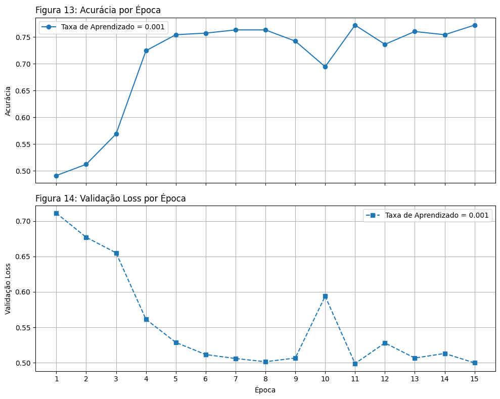
</a>

| Class       | Precision | Recall | F1-Score | Support |
|-------------|-----------|--------|----------|---------|
| Não Aceita Retorno ao Presencial | 0.7518    | 0.7834 | 0.7673   | 1191    |
| Aceita Retorno ao Presencial    | 0.7739    | 0.7414 | 0.7573   | 1191    |

| Metric            | Precision | Recall | F1-Score | Support |
|-------------------|-----------|--------|----------|---------|
| Accuracy          | –         | –      | 0.7624   | 2382    |
| Macro Average     | 0.7628    | 0.7624 | 0.7623   | 2382    |
| Weighted Average  | 0.7628    | 0.7624 | 0.7623   | 2382    |

<a id="ref-figura15"></a>
O modelo foi avaliado em um conjunto de **2.382 amostras**, classificando entre duas categorias: "**Não Aceita**" e "**Aceita**" o retorno ao trabalho presencial. Os principais resultados foram:

**Acurácia geral:** **76.24%** – o modelo acertou aproximadamente 77% das previsões.

##### Classe "**Não Aceita**" (equilibrada):
- **Precision:** 75.18%
- **Recall:** 78.34%
- **F1-score:** 76.73%

##### Classe "**Aceita**" (equilibrada):
- **Precision:** 77.39%
- **Recall:** 74.14%
- **F1-score:** 75.73%

O modelo apresenta um desempenho equilibrado entre as duas classes, com métricas de precisão e sensibilidade (recall) próximas para "Aceita" e "Não Aceita". Isso demonstra uma boa capacidade de identificar corretamente tanto quem aceita quanto quem rejeita o retorno presencial. Esses resultados indicam um modelo mais justo, balanceado e aplicável em cenários reais, como apoio à tomada de decisões em recrutamento ou definição de políticas de trabalho.

<a name="ref-figura15"></a>
<a href="figures/fig15.png">
  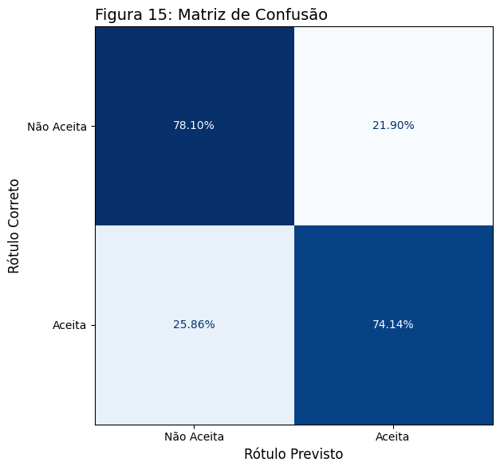
</a>

[↑ Top](#top)

#### Baixar o Modelo
```python
# Baixar o modelo treinado.
!wget https://github.com/ClaytonSdS/DataHackers2025/raw/main/model/modelo_retorno_presencial_v4.h5
```

#### Tutorial de Utilização do Modelo

Para que o modelo **funcione corretamente**, os dados passados para o método **.predict()** precisam estar **estruturados** conforme os nomes da coluna "**Nome no DataFrame**". 

Além disso, as entradas devem estar em conformidade com os valores possíveis indicados na coluna "**Entradas Aceitas**".

| Coluna                     | Nome no DataFrame        | Tipo | Entradas Aceitas |
|---------------------------|---------------------------|------|------------------|
| Idade                     | `idade`                   | int  | Qualquer inteiro |
| Gênero                    | `genero`                  | str  | 'Masculino', 'Feminino', 'Prefiro não informar', 'Outro' |
| Região de Origem          | `regiao_origem`           | str  | 'Sudeste', 'Sul', 'Nordeste', 'Centro-oeste', 'Norte' |
| Região Atual              | `regiao_atual`            | str  | 'Sudeste', 'Sul', 'Nordeste', 'Centro-oeste', 'Norte' |
| Cargo Atual               | `cargo_atual`             | str  | 'Analytics Engineer',<br>'Analista de BI/BI Analyst',<br>'Analista de Dados/Data Analyst',<br>'Analista de Negócios/Business Analyst',<br>'Analista de Suporte/Analista Técnico',<br>'Arquiteto de Dados/Data Architect',<br>'Cientista de Dados/Data Scientist',<br>'Data Product Manager/ Product Manager (PM/APM/DPM/GPM/PO)',<br>'Desconhecido',<br>'Desenvolvedor/ Engenheiro de Software/ Analista de Sistemas',<br>'Engenheiro de Dados/Data Engineer/Data Architect',<br>'Engenheiro de Machine Learning/ML Engineer/AI Engineer',<br>'Estatístico',<br>'Outra Opção',<br>'Outras Engenharias (não inclui dev)',<br>'Professor/Pesquisador' |
| Nível                     | `nivel`                   | str  | 'Júnior', 'Pleno', 'Sênior' |
| Situação de Trabalho      | `situacao_de_trabalho`    | str  | 'Desempregado e não estou buscando recolocação',<br>'Empregado (CLT)',<br>'Empreendedor ou Empregado (CNPJ)',<br>'Estagiário',<br>'Freelancer',<br>'Prefiro não informar',<br>'Servidor Público',<br>'Vivo fora do Brasil e trabalho para empresa de fora do Brasil',<br>'Vivo no Brasil e trabalho remoto para empresa de fora do Brasil' |
| Setor de Atuação          | `setor_atuacao`           | str  | 'Agronegócios',<br>'Área da Saúde',<br>'Área de Consultoria',<br>'Educação',<br>'Entretenimento ou Esportes',<br>'Filantropia/ONG's',<br>'Finanças ou Bancos',<br>'Indústria',<br>'Internet/Ecommerce',<br>'Marketing',<br>'Outra Opção',<br>'Seguros ou Previdência',<br>'Setor Alimentício',<br>'Setor Automotivo',<br>'Setor de Energia',<br>'Setor Farmaceutico',<br>'Setor Imobiliário/ Construção Civil',<br>'Setor Público',<br>'Tecnologia/Fábrica de Software',<br>'Telecomunicação',<br>'Varejo' |
| Modelo Ideal de Trabalho  | `modelo_ideal`            | str  | 'Modelo 100% presencial',<br>'Modelo 100% remoto',<br>'Modelo híbrido com dias fixos de trabalho presencial',<br>'Modelo híbrido flexível (o funcionário tem liberdade para escolher quando estar no escritório presencialmente)' |
| Modelo Atual de Trabalho  | `modelo_atual`            | str  | 'Modelo 100% presencial',<br>'Modelo 100% remoto',<br>'Modelo híbrido com dias fixos de trabalho presencial',<br>'Modelo híbrido flexível (o funcionário tem liberdade para escolher quando estar no escritório presencialmente)' |
| Faixa Salarial            | `faixa_salarial`          | str  | 'Menos de `R$` 1.000/mês',<br>'de `R$` 1.001/mês a `R$` 2.000/mês',<br>'de `R$` 2.001/mês a `R$` 3.000/mês',<br>'de `R$` 3.001/mês a `R$` 4.000/mês',<br>'de `R$` 4.001/mês a `R$` 6.000/mês',<br>'de `R$` 6.001/mês a `R$` 8.000/mês',<br>'de `R$` 8.001/mês a `R$` 12.000/mês',<br>'de `R$` 12.001/mês a `R$` 16.000/mês',<br>'de `R$` 16.001/mês a `R$` 20.000/mês',<br>'de `R$` 20.001/mês a `R$` 25.000/mês', <br>'de `R$` 25.001/mês a `R$` 30.000/mês',<br>'de `R$` 30.001/mês a `R$` 40.000/mês',<br>'Acima de `R$` 40.001/mês'

```python
"""
Exemplo fictício com um dataset composto por dois cadastros de profissionais ("dataset"), onde se deseja prever se o candidato 
"Aceita" ou "Não Aceita" o retorno ao trabalho presencial. 
Em um contexto mais amplo, a ideia é verificar, com base no histórico atual, se a pessoa aceitaria trabalhar presencialmente na empresa em questão.
"""

dataset = pd.DataFrame([
    {
        'idade': 18,
        'genero': 'Feminino',
        'regiao_atual': 'Sudeste',
        'cargo_atual': 'Analista de BI/BI Analyst',
        'nivel': 'Sênior',
        'regiao_origem': 'Sudeste',
        'situacao_de_trabalho': 'Prefiro não informar',
        'setor_atuacao': 'Agronegócios',
        'modelo_ideal': 'Modelo 100% remoto',
        'faixa_salarial': 'Menos de R$ 1.000/mês',
        'modelo_atual': 'Modelo 100% presencial'
    },
    {
        'idade': 41,
        'genero': 'Masculino',
        'regiao_atual': 'Sul',
        'cargo_atual': 'Professor/Pesquisador',
        'nivel': 'Pleno',
        'regiao_origem': 'Sul',
        'situacao_de_trabalho': 'Servidor Público',
        'setor_atuacao': 'Educação',
        'modelo_ideal': 'Modelo 100% presencial',
        'faixa_salarial': 'Acima de R$ 40.001/mês',
        'modelo_atual': 'Modelo 100% presencial'
    }
])
```

```python
# Atenção!!: Para que a linha abaixo funcione corretamente, as células anteriores devem ter sido executadas, pois será necessária a utilização da variável 'data4ai'.

# Criar o objeto preditor
preditor = modelo_preditor(input_df=dataset)

# Preparar os dados para a predição
X_prepared = preditor.prepare_input_data()

# Fazer a predição (probabilidades)
pred_probs = preditor.predict()
print(f"Labels Reais: {pred_probs}\n")

# Traduzir para rótulos legíveis
pred_labels = preditor.translate()
print(f"Labels Traduzidos: {pred_labels}")
```
[↑ Top](#top)

### Conclusão
A conclusão deste relatório é que fatores geográficos, como a localização de origem e atual dos candidatos, proporcionaram um estudo sobre fluxo migratório e tendências, traçando o perfil dos profissionais. Nesse sentido, concluiu-se que a região Norte é a mais promissora para a busca de novos talentos, desde que sejam oferecidas condições compatíveis com as expectativas dos candidatos — como remuneração e plano de carreira — conforme evidenciado na [`Figura 9`](#ref-figura9).

Essa estratégia favorece empresas situadas em regiões com alta probabilidade de rejeição ao modelo presencial, como o Sudeste e o Sul ([`Figura 7`](#ref-figura7)). Contudo, já para empresas localizadas na região Centro-Oeste, a melhor abordagem é buscar, inicialmente, profissionais dentro da própria região, que apresenta a menor taxa de rejeição ao trabalho presencial, o que pode tornar o processo seletivo mais ágil e eficiente.

O estudo também conclui que a faixa salarial é um fator decisivo na aceitação ou rejeição do retorno ao trabalho presencial. Como demonstrado na [`Figura 5`](#ref-figura5), a análise estatística de correlação revela uma alta taxa de rejeição entre profissionais com salários superiores a R$ 3.001.

Com o objetivo de maximizar as chances de contratação para vagas presenciais, o relatório aponta que setores como Indústria, Construção Civil, Agronegócio e Setor Público apresentam maior aderência ao modelo presencial. Esse cenário foi evidenciado não apenas por notícias relevantes, mas também pelos dados do dataset analisado. Por outro lado, empresas atuantes em setores como Varejo, Entretenimento, Marketing, entre outros, tendem a enfrentar mais dificuldades, visto que, conforme demonstrado na [`Figura 3`](#ref-figura3), esses setores apresentam uma probabilidade significativamente maior de rejeição.

Adicionalmente, para apoiar decisões estratégicas de gestores e recrutadores, o estudo mostra que, apesar de a faixa etária dos profissionais da área de tecnologia ser ampla, há uma maior concentração entre os 25 e 35 anos ([`Figura 10`](#ref-figura10)). Esses profissionais, em sua maioria, ocupam cargos de nível Pleno e Sênior ([`Figura 11`](#ref-figura11)). Embora a análise de correlação tenha indicado, na [`Figura 4`](#ref-figura4), que a idade não tem forte relação com a rejeição ao retorno presencial, os dados indicam que profissionais dos níveis Pleno e Sênior tendem a ter maior propensão à rejeição ([`Figura 12`](#ref-figura12)). Por isso, ao buscar esse público, é fundamental considerar fatores como região de moradia, idade, cargo, nível e, principalmente, as expectativas e preferências desses profissionais em relação aos benefícios oferecidos.

Além disso, caso a empresa deseje aumentar sua taxa de aceitação ao modelo presencial, uma abordagem recomendada é priorizar candidatos com idade entre 18 e 24 anos. Conforme demonstrado na [`Figura 11`](#ref-figura11), a proporção de profissionais de nível "Júnior" nessa faixa etária é superior à de Plenos e Seniores. Esse fator é relevante, pois, conforme mostra a [`Figura 12`](#ref-figura12), profissionais de nível "Júnior" apresentam a menor probabilidade de rejeição ao trabalho presencial.

Finalmente, o presente relatório elaborou um modelo de classificação utilizando redes neurais com camadas densas, com o objetivo de prever a aceitação ou rejeição ao retorno presencial, com base no perfil dos candidatos — considerando variáveis como idade, gênero, região, nível profissional, situação de trabalho, entre outras.
Para mais informações, especialmente sobre como utilizar a ferramenta, basta navegar até a **seção [Modelo de Classificação (IA)](#modelo-de-classificação-ia)**.

[↑ Top](#top)

## Referências

<a id="ref-1"></a>
**1**. Barbosa Filho, F. de H., Veloso, F., & Peruchetti, P. (2021, 9 de dezembro). *Diferenças estaduais do trabalho remoto no Brasil*. Blog do IBRE. https://blogdoibre.fgv.br/posts/diferencas-estaduais-do-trabalho-remoto-no-brasil

<a id="ref-2"></a>
**2**. Bloom, N., Barrero, J. M., & Davis, S. J. (2023). *Survey: Remote work isn't going away — and executives know it*. Harvard Business Review. https://hbr.org/2023/08/survey-remote-work-isnt-going-away-and-executives-know-it

<a id="ref-3"></a>
**3**. CNA. (2020). *Agro lidera criação de empregos em 2020*. Confederação da Agricultura e Pecuária do Brasil. https://www.cnabrasil.org.br/noticias/agro-lidera-criacao-de-empregos-em-2020

<a id="ref-4"></a>
**4**. ENAP. (2020). *57% dos servidores públicos federais querem voltar ao trabalho presencial em regime escalonado*. Escola Nacional de Administração Pública. https://www.enap.gov.br/en/?catid=12&id=3055%3A57-dos-servidores-publicos-federais-querem-voltar-ao-trabalho-presencial-em-regime-escalonado&view=article

<a id="ref-5"></a>
**5**. eRural. (2020). *Na contramão, agro e construção geram vagas em 2020*. https://www.erural.net/conteudo/na-contramao-agro-e-construcao-geram-vagas-em-2020

<a id="ref-6"></a>
**6**. Gallup. (2022). *The top things employees want in their next job*. https://www.gallup.com/workplace/389807/top-things-employees-next-job.aspx

<a id="ref-7"></a>
**7**. IT Forum. (2024). *Empresas de tecnologia mostram diferentes estratégias para retorno ao escritório*. https://itforum.com.br/noticias/empresas-de-tecnologia-retorno-ao-escritorio

<a id="ref-8"></a>
**8**. Robert Half. (2024). *Modelos de trabalho - 2ª edição: Panorama das práticas adotadas pelas empresas no Brasil*. https://www.roberthalf.com/content/dam/roberthalf/documents/br/pt/indexed/2024-modelos_de_trabalho-2ed-robert_half_br.pdf
